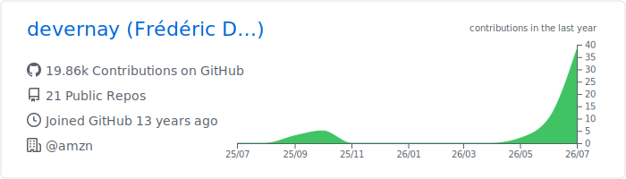
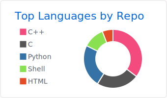
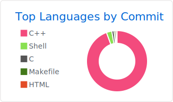
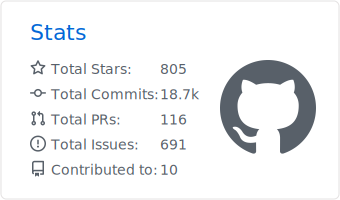
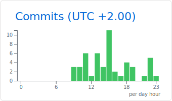

## Frédéric Devernay

Nantes area, France · [@amzn](https://github.com/amzn) · maintainer of [@NatronGitHub](https://github.com/NatronGitHub)

---

Cards regenerated daily by <a href="https://github.com/vn7n24fzkq/github-profile-summary-cards">github-profile-summary-cards</a> via GitHub Actions.

<!-- profile README -->
